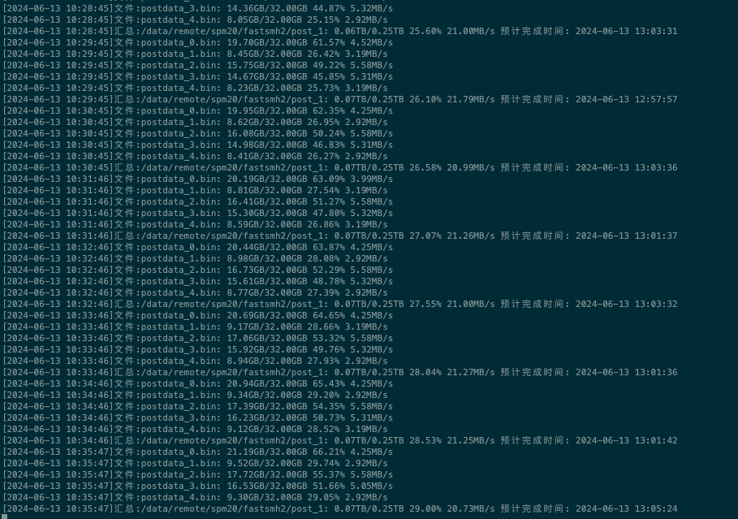

# spacemesh快P程序

#### 一. 程序说明

##### 1. fastsmh是spacemesh的快P软件，对于30系的显卡，P图速度最高可以提升50%，40系则提升不明显，只支持N卡，不支持A卡


##### 2. 具体数据(数据为单次测试，没有条件进行多型号测试，所以不一定百分百准确，只做为参考)

| 型号  | 官方数据(MB/s)  | fastsmh速度(MB/s)  | 提升比例  |
|:----------|:----------|:----------|:----------|
| 3070    | 2.51    | 3.81    | 50%    |
| 3060    | 2    | 2.6    | 33.5%    |
| 3080    | 2.9    | 4.9  | 68.9%    |
| 3080TI    | 3.5    | 6.4  | 82.8%    |
| 3090    | 4.0    | 6.9    | 72.5%    |
| 40HX    | 1.6    | 2.6    | 72.5%    |
##### 3. 运行效果



##### 二. 使用方法

```
#安装依赖
apt install libgomp1 ocl-icd-opencl-dev -y
```

```
usage: fastsmh [-h] [--num-units] [--nonces] [-d DIR [DIR ...]] [-v]

This script is for fastsmh runner.

options:
  -h, --help            show this help message and exit 
  --num-units           numUnits, default is 32  #指定 numUnits, 其实就是指定图大小, 一个numUnits为32G, 比如一个1T的图,这里就指定 16, 默认值为32
  --max-filesize        maxFileSize, default is 32 #单图大小,默认是32, 单位是G
  --reserved-size       reserved size, default is 0 #磁盘预留空间，默认是P满意，单位为G
  -d DIR [DIR ...], --dir DIR [DIR ...]          #指定图的保存路径，可以指定多个 比如: ./fastsmh -d /mnt/sda -d /mnt/sdb
                        plot dirs
  -v, --version         show version
```

###### 如:
```
mkdir -p /data/fastsmh
cd /data/fastsmh
wget https://github.com/sxwailyc/fastsmh/releases/download/v0.3/fastsmh
chmod +x fastsmh
#/mnt/sdb 改为您的路径
./fastsmh -d /mnt/sdb   
```

#### 三. 常见问题


##### 1. 本软件收费吗?

###### 答: 本软件收费，每台机器收费为100元, 永久授权, 新用户可以免费试用三天，请添加客服微信获取试用资格

##### 2. 本软件支持windows吗?

###### 答: 不支持windows, 只支持linux

##### 3. 本软件支持A卡吗?

###### 答: 不支持

##### 4. 可以P到共享目录吗?

###### 答: 可以P到共享目录，但samba共享存在一个问题，如果存储机挂载的硬盘是是在samba共享目录下面的话，会获取不到磁盘的剩余空间，导致P图无法进行, 比如

###### 下面这种情况可以
```
samba 共享目录 为 /mnt/sda
硬盘挂载目录为  /mnt/sda
```

###### 下面这种情况不行
```
samba共享目录为 /mnt
硬盘挂载目录为 /mnt/sda
```


#### 四. 如何购买

###### 可以添加客服微信购买或者申请试用

###### 1. 客服微信: lycaisxw

###### 2. 扫码添加：


